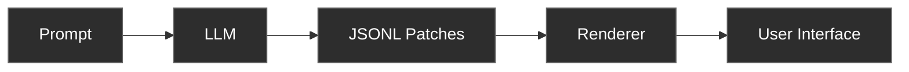
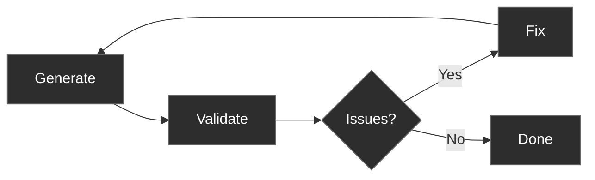
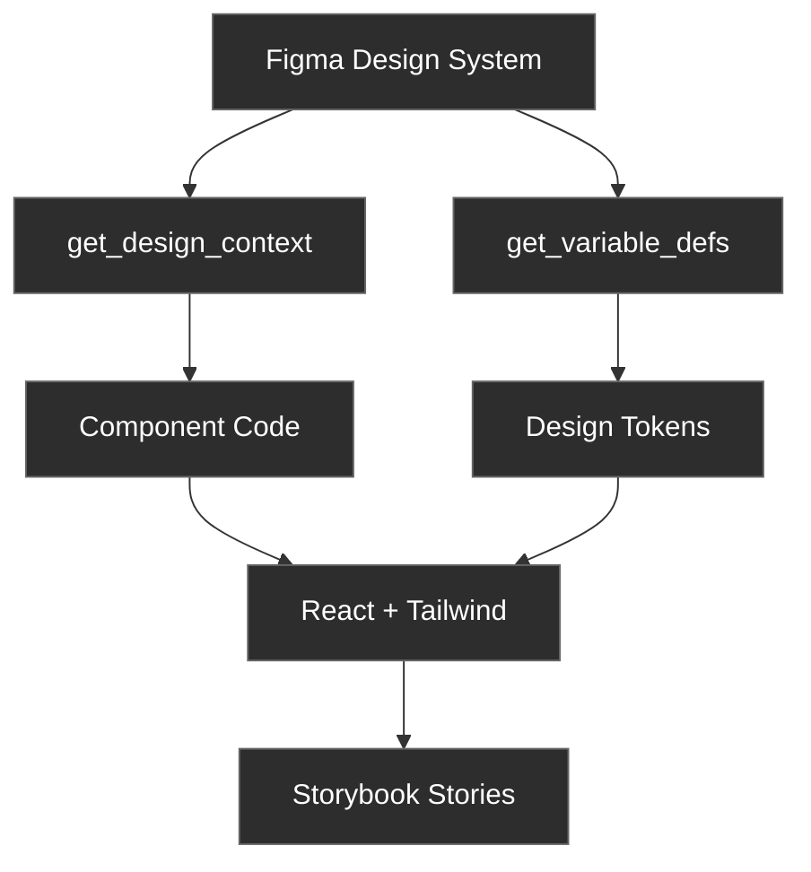

<style src="./style.css"></style>

<div class="flex flex-col items-center justify-center h-full">
  <h1 class="text-6xl font-bold mb-8 leading-tight">
    From Prompts to<br/>Predictable User Interfaces
  </h1>
  <p class="text-2xl text-gray-400 mt-4">
    Feedback loops, MCP servers, skills, and libraries
  </p>
</div>

---
layout: center
---

<div class="flex flex-col items-center justify-center h-full">
  <h1 class="text-5xl font-bold mb-12">The Problem</h1>

  <div class="text-4xl font-semibold text-white mb-16">
    AI-generated UIs are naturally unpredictable
  </div>

  <v-click>
    <div class="space-y-4 text-2xl text-gray-400">
      <div>→ Same prompt, different outputs</div>
      <div>→ Hard to reproduce results</div>
      <div>→ Difficult to maintain consistency</div>
    </div>
  </v-click>
</div>

---
layout: center
---

<div class="flex flex-col items-center justify-center h-full">
  <h1 class="text-5xl font-bold mb-12">The Solution</h1>

  <div class="text-4xl font-semibold text-white mb-16">
    Constraints enable predictability
  </div>

  <v-click>
    <div class="grid grid-cols-3 gap-16 text-center px-12">
      <div class="flex flex-col items-center">
        <div class="text-7xl mb-6">📋</div>
        <div class="text-2xl font-semibold text-white mb-2">Structured Output</div>
        <div class="text-lg text-gray-400">json-render</div>
      </div>
      <div class="flex flex-col items-center">
        <div class="text-7xl mb-6">🔁</div>
        <div class="text-2xl font-semibold text-white mb-2">Feedback Loops</div>
        <div class="text-lg text-gray-400">/agent-browser</div>
      </div>
      <div class="flex flex-col items-center">
        <div class="text-7xl mb-6">🎨</div>
        <div class="text-2xl font-semibold text-white mb-2">Design Contracts</div>
        <div class="text-lg text-gray-400">Figma MCP</div>
      </div>
    </div>
  </v-click>
</div>

---
layout: section
---

<div class="flex flex-col items-center justify-center h-full">
  <div class="text-7xl mb-8">📋</div>
  <h1 class="text-6xl font-bold mb-6">json-render</h1>
  <p class="text-2xl text-gray-400">Structured output format</p>
</div>

---
layout: center
---

# json-render Architecture



<div class="mt-8 flex items-center justify-center text-gray-400">
AI → JSON → UI
</div>

---
layout: center
---

# Component Catalog

```ts
export const catalog = createCatalog({
  components: {
    Card: {
      props: z.object({
        title: z.string(),
        description: z.string().nullable(),
      }),
      hasChildren: true,
    },
    Button: {
      props: z.object({
        label: z.string(),
      }),
    },
    Text: {
      props: z.object({
        content: z.string(),
      }),
    },
  },
});
```

---

# System Prompt

```ts{*}{maxHeight:'400px'}
const SYSTEM_PROMPT = `You are a UI generator that outputs JSONL (JSON Lines) patches.

AVAILABLE COMPONENTS:
Card, Button, Text

COMPONENT DETAILS:
- Card: { title: string, description?: string | null } - Container with title, can have children
- Button: { label: string } - Button with label
- Text: { content: string } - Text paragraph

OUTPUT FORMAT:
Output JSONL where each line is a patch operation. Use a FLAT key-based structure:

OPERATIONS:
- {"op":"set","path":"/root","value":"main-card"} - Set the root element key
- {"op":"add","path":"/elements/main-card","value":{...}} - Add an element by unique key

ELEMENT STRUCTURE:
{
  "key": "unique-key",
  "type": "ComponentType",
  "props": { ... },
  "children": ["child-key-1", "child-key-2"]  // Array of child element keys (only for Card)
}

RULES:
1. First set /root to the root element's key
2. Add each element with a unique key using /elements/{key}
3. Parent elements list child keys in their "children" array
4. Stream elements progressively - parent first, then children
5. Each element must have: key, type, props
6. Children array contains STRING KEYS, not nested objects
7. Only Card can have children

EXAMPLE - Welcome Card:
{"op":"set","path":"/root","value":"welcome-card"}
{"op":"add","path":"/elements/welcome-card","value":{"key":"welcome-card","type":"Card","props":{"title":"Welcome","description":"Hello there!"},"children":["greeting-text","action-btn"]}}
{"op":"add","path":"/elements/greeting-text","value":{"key":"greeting-text","type":"Text","props":{"content":"Thanks for visiting our app."}}}
{"op":"add","path":"/elements/action-btn","value":{"key":"action-btn","type":"Button","props":{"label":"Get Started"}}}

Generate JSONL patches now:`;
```

<div class="flex items-center justify-center mt-4 text-sm text-gray-400">
Catalog → System Prompt → Patches
</div>

---
layout: center
---

# Example Output

<!--TODO: add screenshot-->
<!---->

<div class="mt-4 text-sm text-gray-400">
Prompt → JSONL patches → React components
</div>

---
layout: center
class: 'text-center'
---

# Live Demo

<div class="text-2xl mt-8 text-gray-400">
json-render streaming UI generation
</div>

<div class="mt-12">
→ Open http://localhost:3000
</div>

---
layout: section
---


<div class="flex flex-col items-center justify-center h-full">
  <div class="text-7xl mb-8">🔁</div>
  <h1 class="text-6xl font-bold mb-6">Feedback Loops</h1>
  <p class="text-2xl text-gray-400">Visual validation</p>
</div>

<!--maybe add another slide here with that blog post about feedback loop-->
---
layout: center
---

<div class="flex flex-col justify-center h-full px-16">
  <h1 class="text-5xl font-bold mb-12">Why Feedback Matters</h1>

  <div class="text-4xl font-semibold text-white mb-16">
    LLMs can't predict visual output
  </div>

  <v-click>
    <div class="grid grid-cols-2 gap-16">
      <div class="bg-blue-500/10 border border-blue-500/30 rounded-lg p-8">
        <div class="text-3xl font-semibold mb-6 text-blue-400">✓ Can Generate</div>
        <div class="space-y-3 text-xl text-gray-300">
          <div>• Valid React code</div>
          <div>• Correct Tailwind classes</div>
          <div>• Proper HTML structure</div>
          <div>• Type-safe props</div>
        </div>
      </div>
      <div class="bg-red-500/10 border border-red-500/30 rounded-lg p-8">
        <div class="text-3xl font-semibold mb-6 text-red-400">✗ Can't Predict</div>
        <div class="space-y-3 text-xl text-gray-300">
          <div>• Actual layout</div>
          <div>• Element positioning</div>
          <div>• Visual hierarchy</div>
          <div>• Responsive behavior</div>
        </div>
      </div>
    </div>
  </v-click>
</div>

---
layout: center
---

# Feedback Loop Pattern



<div class="mt-8 text-gray-400">
Iterate until validation passes
</div>

---
layout: two-cols
---

# /agent-browser

<div class="text-green-400 text-xl mb-4">✓ Context Efficient</div>

```
Output: Natural language

"Form centered in viewport,
email field visible with label,
submit button prominent,
good visual hierarchy"

Size: ~500 bytes
```

<div class="mt-4 text-sm text-gray-400">
100+ iterations possible
</div>

::right::

# Playwright MCP

<div class="text-yellow-400 text-xl mb-4">⚠ Context Heavy</div>

```
Output: Snapshot + Screenshot

Markdown accessibility tree
+ Base64 PNG image
+ Full DOM structure

Size: ~50KB+
```

<div class="mt-4 text-sm text-gray-400">
Limited iterations
</div>

---
layout: center
---

# Example: Login Form
<!--TODO: add image-->
<!---->

<div class="mt-4 text-sm text-gray-400">
/agent-browser validates layout, elements, visual hierarchy
</div>

---
layout: center
class: 'text-center'
---

# Live Demo

<div class="text-2xl mt-8 text-gray-400">
Visual validation with /agent-browser
</div>

<div class="mt-12">
→ Open http://localhost:3001
</div>

---
layout: section
---

<div class="flex flex-col items-center justify-center h-full">
  <div class="text-7xl mb-8">🎨</div>
  <h1 class="text-6xl font-bold mb-6">Design to Code</h1>
  <p class="text-2xl text-gray-400">Design system as contract</p>
</div>

---
layout: center
---

<div class="flex flex-col justify-center h-full px-16">
  <h1 class="text-5xl font-bold mb-16">The Design-Dev Gap</h1>

  <div class="grid grid-cols-2 gap-16">
    <div class="bg-gray-800/30 border border-gray-700 rounded-lg p-8">
      <div class="text-3xl font-semibold mb-8 text-gray-300">Traditional Handoff</div>
      <div class="space-y-4 text-xl text-gray-400">
        <div class="flex items-start">
          <span class="text-gray-500 mr-3">1.</span>
          <span>Designer creates mockups</span>
        </div>
        <div class="flex items-start">
          <span class="text-gray-500 mr-3">2.</span>
          <span>Dev interprets visuals</span>
        </div>
        <div class="flex items-start">
          <span class="text-red-400 mr-3">3.</span>
          <span>Implementation drifts</span>
        </div>
        <div class="flex items-start">
          <span class="text-red-400 mr-3">4.</span>
          <span>Iterations needed</span>
        </div>
        <div class="flex items-start">
          <span class="text-red-400 mr-3">5.</span>
          <span>Inconsistencies emerge</span>
        </div>
      </div>
    </div>

    <div class="bg-green-500/10 border border-green-500/30 rounded-lg p-8">
      <div class="text-3xl font-semibold mb-8 text-green-400">With Figma MCP</div>
      <div class="space-y-4 text-xl text-gray-300">
        <div class="flex items-start">
          <span class="text-green-400 mr-3">1.</span>
          <span>Design system in Figma</span>
        </div>
        <div class="flex items-start">
          <span class="text-green-400 mr-3">2.</span>
          <span>Extract with MCP</span>
        </div>
        <div class="flex items-start">
          <span class="text-green-400 mr-3">3.</span>
          <span>Generate components</span>
        </div>
        <div class="flex items-start">
          <span class="text-green-400 mr-3">4.</span>
          <span>Storybook stories</span>
        </div>
        <div class="flex items-start">
          <span class="text-green-400 mr-3">5.</span>
          <span>Design = code truth</span>
        </div>
      </div>
    </div>

  </div>
</div>

---
layout: center
---

# Figma MCP Workflow



---
layout: two-cols
---

# MCP Tools

```ts
// Extract component
get_design_context(fileKey, nodeId);

// Extract tokens
get_variable_defs(fileKey, nodeId);

// Visual reference
get_screenshot(fileKey, nodeId);
```

::right::

# Output

```ts
// Generated component
Button({
  variant: "primary",
  size: "medium",
  children: "Button",
});

// Design tokens
tokens.color.brandDefault;
tokens.typography.sizeMedium;
tokens.spacing.md;
```

---
layout: two-cols
---

# Figma Source
<!--TODO: add image-->
<!---->

<div class="mt-4 text-xs text-gray-400">
18 button variants (3×3×2)
</div>

::right::

# Storybook Output
<!--TODO: add image-->
<!---->

<div class="mt-4 text-xs text-gray-400">
Generated components + stories
</div>

---
layout: center
class: 'text-center'
---

# Live Demo

<div class="text-2xl mt-8 text-gray-400">
Figma → Storybook with MCP
</div>

<div class="mt-12">
→ Open Storybook
</div>

---
layout: center
---

<div class="flex flex-col justify-center h-full px-20">
  <h1 class="text-5xl font-bold mb-16 text-center">Key Takeaways</h1>

  <div class="space-y-12">
    <v-click>
      <div class="bg-blue-500/10 border border-blue-500/30 rounded-lg p-8">
        <div class="text-3xl font-bold text-white mb-4">1. Constraints → Predictability</div>
        <div class="text-2xl text-gray-300">Structured formats, feedback loops, design contracts</div>
      </div>
    </v-click>

    <v-click>
      <div class="bg-green-500/10 border border-green-500/30 rounded-lg p-8">
        <div class="text-3xl font-bold text-white mb-4">2. Choose the Right Tool</div>
        <div class="text-2xl text-gray-300">json-render for UI, /agent-browser for validation, Figma MCP for design</div>
      </div>
    </v-click>

    <v-click>
      <div class="bg-purple-500/10 border border-purple-500/30 rounded-lg p-8">
        <div class="text-3xl font-bold text-white mb-4">3. Context Budget Matters</div>
        <div class="text-2xl text-gray-300">Optimize for agentic workflows</div>
      </div>
    </v-click>

  </div>
</div>

---
layout: center
---

<div class="flex flex-col items-center justify-center h-full">
  <h1 class="text-7xl font-bold mb-12">Thank You</h1>

  <div class="text-3xl text-gray-400 mb-16">
    Questions?
  </div>

  <div class="text-xl text-blue-400 font-mono bg-gray-900/50 px-8 py-4 rounded-lg border border-gray-800">
    github.com/ubmit/from-prompts-to-predictable-user-interfaces
  </div>
</div>
