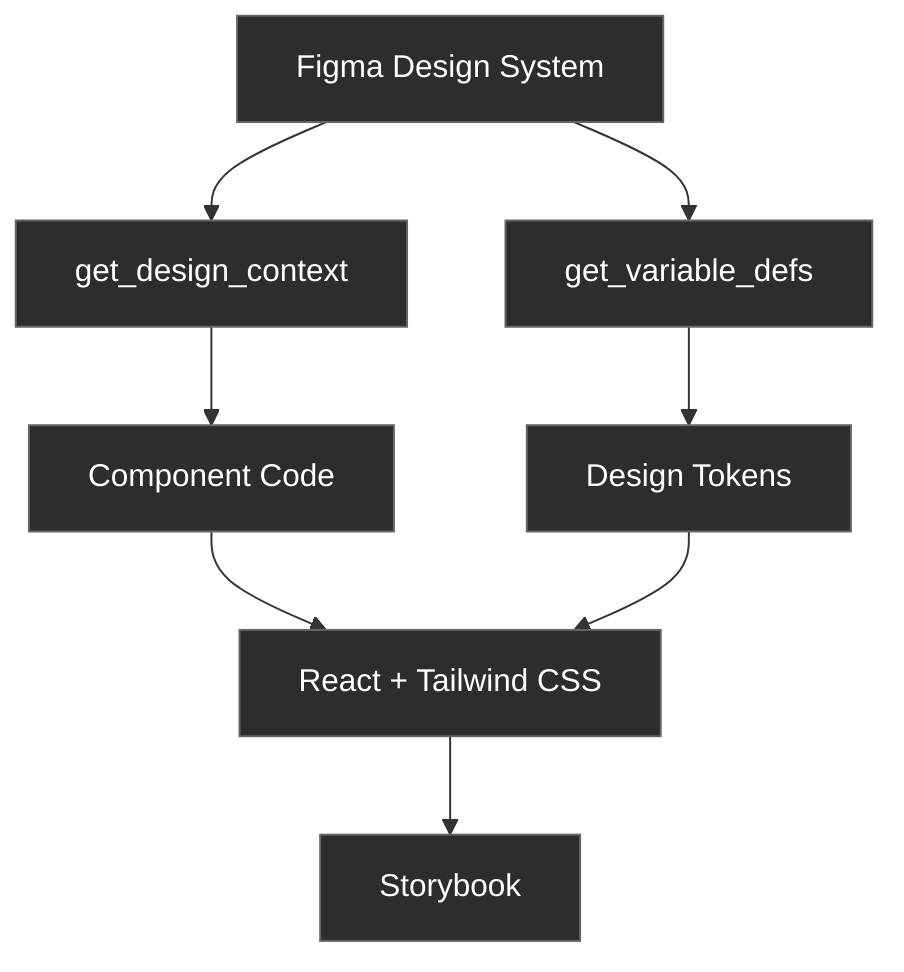
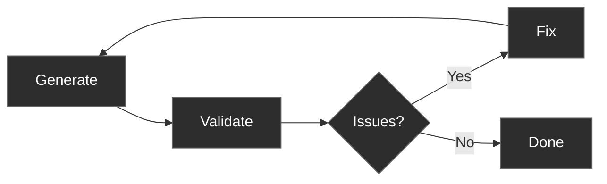
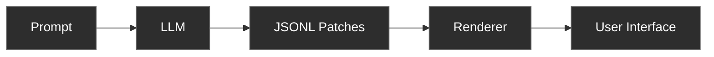

<style src="./style.css"></style>

<div class="flex flex-col items-center justify-center h-full">
  <h1 class="text-6xl font-bold mb-8 leading-tight">
    From Prompts to<br/>Predictable User Interfaces
  </h1>
  <p class="text-2xl text-gray-400 mt-4">
    Feedback loops, MCP servers, skills, and libraries
  </p>
</div>

<!--
I developed the talk in a way that the knowledge I'm sharing is accessible to anyone, regardless of seniority and area of expertise. 

I know there's at least one backend engineer here afraid of being discovered, but I told him to relax because not only the talk is inclusive, but the whole event is inclusive
-->

---
layout: center
---

<div class="flex flex-col items-center justify-center h-full px-20">
    <h1 class="text-5xl font-bold mb-4">hi, I'm gui 👋</h1>
    <div>
        <p class="text-2xl font-regular text-center text-gray-400">
            <span class="font-italic">agentic frontend engineer</span>, originally from the other side (of the <span class="text-blue-300">atlantic</span>) 🌴 and a <a href="https://ubmit.dev/moving" class="text-orange-300">strava user</a> 🏊🚴🏃
        </p>
    </div>
    <div class="mt-10 text-lg text-gray-400">
        <a href="https://ubmit.dev/" class="hover:underline">proxy for socials → ubmit.dev/{x, github, linkedin}</a>
    </div>
</div>

<!--
Present myself, say thanks to everyone for coming and ask for a round of applauses to FE.OPO staff for making the event happen!
-->

---
layout: center
---

<div class="flex flex-col items-center justify-center h-full">
  <h1 class="text-5xl font-bold">AI-generated UIs are naturally unpredictable</h1>
</div>

<!--
The Problem

→ LLMs are inherently non-deterministic

→ Same prompt, different outputs

→ Hard to reproduce results

→ Difficult to maintain consistency
-->

---
layout: center
---

<div class="flex flex-col items-center justify-center h-full">
  <h1 class="text-5xl font-bold">Constraints enable predictability</h1>

  <v-click>
    <div class="grid grid-cols-3 gap-16 text-center px-12 mt-12">
      <div class="flex flex-col items-center">
        <div class="text-7xl mb-6">🎨</div>
        <div class="text-2xl font-semibold text-white mb-2">Design Contracts</div>
        <div class="text-lg text-gray-400">Figma MCP</div>
      </div>
      <div class="flex flex-col items-center">
        <div class="text-7xl mb-6">🔁</div>
        <div class="text-2xl font-semibold text-white mb-2">Feedback Loops</div>
        <div class="text-lg text-gray-400">agent-browser</div>
      </div>
      <div class="flex flex-col items-center">
        <div class="text-7xl mb-6">📋</div>
        <div class="text-2xl font-semibold text-white mb-2">Structured Output</div>
        <div class="text-lg text-gray-400">json-render</div>
      </div>
    </div>
  </v-click>
</div>

<!--
The Solution

Add constraints and guardrails such as:

→ Design Contracts

→ Visual Feedback Loops

→ Structured Output
-->

---
layout: section
---

<div class="flex flex-col items-center justify-center h-full">
  <div class="text-7xl mb-8">🎨</div>
  <h1 class="text-6xl font-bold mb-6">design → code</h1>
  <p class="text-2xl text-gray-400">Design system as contract</p>
</div>

---
layout: center
---

# Traditional Handoff
<div class="space-y-4 text-lg text-gray-400 text-left max-w-xl">
    <v-click>
        <div>1. Designer creates mockups</div>
    </v-click>
    <v-click>
        <div>2. Dev interprets visuals</div>
    </v-click>
    <v-click>
        <div class="text-red-400">3. Implementation drifts</div>
    </v-click>
</div>

<!--
Although I'm calling it the "traditional handoff", I really hope this won't be the "normal way" someday. that's definitely not how designers and engineers should collaborate together. we need to find always to bridge the gap.
-->

---
layout: center
---

# With Figma MCP
<div class="space-y-4 text-lg text-gray-300 text-left max-w-xl">
    <v-click>
        <div>1. Design in Figma</div>
    </v-click>
    <v-click>
        <div>2. Extract with MCP</div>
    </v-click>
    <v-click>
        <div>3. DaC (Design as Code™)</div>
    </v-click>
</div>

<!--
In my opinion, which probably doesn't hold much weight because I'm not a designer, this is probably the best time to be a Designer.

The barrier to deliver design as code has pretty much fallen. At best, there are just some ruins now. 

A designer now is able to "translate" Figma files to TypeScript files with all the prop types and tokens. Instead of delivering design work through mockups, now they can also devliver design as code.
-->

---
layout: center
---

# Figma MCP Workflow



---
layout: two-cols
---

# Figma MCP Tools

```ts
// Extract component
get_design_context(fileKey, nodeId);

// Extract tokens
get_variable_defs(fileKey, nodeId);
```

::right::

# Output

```ts
// Generated component story
export const PrimaryDefaultMedium: Story = {
  args: {
    variant: "primary",
    size: "medium",
    children: "Button",
  },
};

// Design tokens
tokens.color.brandDefault;
tokens.typography.sizeMedium;
tokens.spacing.md;
```

<!--
Unfortunately, I had only SIX calls per month to Figma from its MCP. I'd need a paid subscription to raise the rate limit.
    
Considering that, my experimentation was short and I couldn't try out everything I wanted. One of the things where it fell short, although I'm not sure whether it was my fault (bad prompt) or not, was to generate the Tailwind config with the tokens. To achieve that, I had to use CC. Which is still an ok and totally acceptable workflow, but it would've been nice to get it directly from Figma. I'll investigate this a bit more.
-->

---
layout: two-cols
---

# Figma Source


<div class="mt-4 text-xs text-gray-400">
18 button variants (3×3×2)
</div>

::right::

# Storybook Output


<div class="mt-4 text-xs text-gray-400">
Generated components + stories
</div>

---
layout: center
class: 'text-center'
---

# (Not) Live Demo

<div class="text-2xl mt-8 text-gray-400">
 From design mockup to Storybook with Figma MCP 
</div>

<!--
→ DEMO: http://localhost:6006
-->

---
layout: section
---

<div class="flex flex-col items-center justify-center h-full">
  <div class="text-7xl mb-8">🔁</div>
  <h1 class="text-6xl font-bold mb-6">Visual Feedback Loops</h1>
  <p class="text-2xl text-gray-400">Visual validation</p>
</div>

---
layout: center
---

<div class="flex flex-col justify-center h-full px-16">
  <h1 class="text-5xl font-bold mb-12 text-center">Why Feedback Matters</h1>

  <div class="text-2xl font-semibold text-gray-400 mb-8 text-center">
    LLMs can't verify visual output without rendering
  </div>

  <div class="grid grid-cols-2 gap-16">
    <v-click>
      <div class="bg-blue-500/10 border border-blue-500/30 rounded-lg p-8">
        <div class="text-2xl font-semibold mb-6 text-blue-400 whitespace-nowrap">✓ Can Reason About</div>
        <div class="space-y-3 text-xl text-gray-300">
          <div>• Layout concepts</div>
          <div>• CSS rules</div>
          <div>• Visual principles</div>
          <div>• Component structure</div>
        </div>
      </div>
    </v-click>
    <v-click>
      <div class="bg-red-500/10 border border-red-500/30 rounded-lg p-8">
        <div class="text-2xl font-semibold mb-6 text-red-400 whitespace-nowrap">✗ Can't Verify</div>
        <div class="space-y-3 text-xl text-gray-300">
          <div>• Actual rendered output</div>
          <div>• Visual bugs</div>
          <div>• Edge cases</div>
          <div>• Browser behavior</div>
        </div>
      </div>
    </v-click>
  </div>
</div>

---
layout: center
---

# Feedback Loop Pattern



<div class="mt-8 text-gray-400 text-center">
    Iterate until validation passes
</div>

---
layout: center
---

# agent-browser

<div class="mt-4 text-gray-400">
    Headless browser automation CLI
</div>

```
# Navigate and get snapshot
agent-browser open example.com
agent-browser snapshot -i

# Output:
# - heading "Example Domain" [ref=e1]
# - link "More information..." [ref=e2]

# Interact using refs
agent-browser click @e2
agent-browser screenshot page.png
agent-browser close
```

<div class="mt-4 text-sm text-gray-400 text-center">
    the <span class="text-gray-300">agent-browser</span> skill validates layout, elements, visual hierarchy
</div>

<!--
agent-browser is my favorite tool for browser automation and visual validation because it's context efficient.

its output is natural language, so it will naturally save you tokens when comparing to similar tools available.
-->

---
layout: center
class: 'text-center'
---

# Live Demo

<div class="text-2xl mt-8 text-gray-400">
Visual validation with agent-browser
</div>

<!--
→ DEMO: http://localhost:3001

→ PROMPT: Navigate to http://localhost:3001 and validate the login form layout. Check if the email input, password input, and submit button are all visible and properly positioned.
-->

---
layout: section
---

<div class="flex flex-col items-center justify-center h-full">
  <div class="text-7xl mb-8">📋</div>
  <h1 class="text-6xl font-bold mb-6">json-render</h1>
  <p class="text-2xl text-gray-400">Structured output format</p>
</div>

---
layout: center
---

# json-render Architecture



<div class="mt-8 flex items-center justify-center text-gray-400">
AI → JSON → UI
</div>

---
layout: center
---

# Component Catalog

```ts
export const catalog = createCatalog({
  components: {
    Card: {
      props: z.object({
        title: z.string(),
        description: z.string().nullable(),
      }),
      hasChildren: true,
    },
    Button: {
      props: z.object({
        label: z.string(),
      }),
    },
    Text: {
      props: z.object({
        content: z.string(),
      }),
    },
  },
});
```

---

# System Prompt

```ts{*}{maxHeight:'400px'}
const SYSTEM_PROMPT = `You are a UI generator that outputs JSONL (JSON Lines) patches.

AVAILABLE COMPONENTS:
Card, Button, Text

COMPONENT DETAILS:
- Card: { title: string, description?: string | null } - Container with title, can have children
- Button: { label: string } - Button with label
- Text: { content: string } - Text paragraph

OUTPUT FORMAT:
Output JSONL where each line is a patch operation. Use a FLAT key-based structure:

OPERATIONS:
- {"op":"set","path":"/root","value":"main-card"} - Set the root element key
- {"op":"add","path":"/elements/main-card","value":{...}} - Add an element by unique key

ELEMENT STRUCTURE:
{
  "key": "unique-key",
  "type": "ComponentType",
  "props": { ... },
  "children": ["child-key-1", "child-key-2"]  // Array of child element keys (only for Card)
}

RULES:
1. First set /root to the root element's key
2. Add each element with a unique key using /elements/{key}
3. Parent elements list child keys in their "children" array
4. Stream elements progressively - parent first, then children
5. Each element must have: key, type, props
6. Children array contains STRING KEYS, not nested objects
7. Only Card can have children

EXAMPLE - Welcome Card:
{"op":"set","path":"/root","value":"welcome-card"}
{"op":"add","path":"/elements/welcome-card","value":{"key":"welcome-card","type":"Card","props":{"title":"Welcome","description":"Hello there!"},"children":["greeting-text","action-btn"]}}
{"op":"add","path":"/elements/greeting-text","value":{"key":"greeting-text","type":"Text","props":{"content":"Thanks for visiting our app."}}}
{"op":"add","path":"/elements/action-btn","value":{"key":"action-btn","type":"Button","props":{"label":"Get Started"}}}

Generate JSONL patches now:`;
```

<div class="flex items-center justify-center mt-4 text-sm text-gray-400">
Catalog → System Prompt → JSONL Patches
</div>

---
layout: center
---


<div class="flex items-center justify-center mt-4 text-sm text-gray-400">
"Build a pricing page" → JSON → UI
</div>

---
layout: center
class: 'text-center'
---

# Live Demo

<div class="text-2xl mt-8 text-gray-400">
json-render streaming UI generation
</div>

<!--
→ DEMO: http://localhost:3000

→ PROMPT: Create a welcome card for the Frontend.OPO #9 event with a button that navigates to their website https://frontendporto.dev/
-->

---
layout: center
---

<div class="flex flex-col justify-center h-full px-20 py-8">
  <h1 class="text-4xl font-bold mb-8 text-center">Key Takeaways</h1>

  <v-click>
    <div class="bg-blue-500/10 border border-blue-500/30 rounded-lg p-6 mb-6">
      <div class="text-2xl font-bold text-white mb-2">1. Constraints → Predictability</div>
      <div class="text-lg text-gray-300">Guardrails are your best friend when working with LLMs</div>
    </div>
  </v-click>

  <v-click>
    <div class="bg-green-500/10 border border-green-500/30 rounded-lg p-6 mb-6">
      <div class="text-2xl font-bold text-white mb-2">2. Choose the Right Tool</div>
      <div class="text-lg text-gray-300">The tools presented might not fit your workflow, we need to choose wisely 🧙</div>
    </div>
  </v-click>

  <v-click>
    <div class="bg-orange-500/10 border border-orange-500/30 rounded-lg p-6">
      <div class="text-2xl font-bold text-white mb-2">3. Context Budget Matters</div>
      <div class="text-lg text-gray-300">Optimize for agentic workflows</div>
    </div>
  </v-click>
</div>

---
layout: center
---

<div class="flex flex-col items-center justify-center gap-4 max-w-xl">
  <div class="text-xl text-gray-300 text-center">
    it's almost ending, I promise! there's just <span class="font-bold">one more thing</span>
  </div>
  <v-click>
      <div class="text-gray-400 text-center font-italic">
          no, I'm not taking an iPod out from my jeans' small pocket or a MacBook Air from an envelope 
      </div>
  </v-click>
  <v-click>
    <div class="text-xl text-gray-300 text-center">
        I'm actively looking for my next role as an engineer building user-first products with a focus on UI ✨
    </div>
  </v-click>
  <v-click>
    <div class="text-xl text-gray-300 text-center">
        know something interesting? <a href="mailto:gui@ubmit.dev" class="text-blue-400 hover:text-blue-300 transition-colors no-underline">gui@ubmit.dev</a>  
    </div>
  </v-click>
</div>


---
layout: center
---

<div class="flex flex-col items-center justify-center h-full">
  <h1 class="text-7xl font-bold mb-12">Thank You</h1>

  <div class="text-3xl text-gray-400 mb-16">
    Questions?
  </div>

  <a href="https://github.com/ubmit/from-prompts-to-predictable-user-interfaces" class="github-link text-xl text-blue-400 font-mono bg-gray-900/50 px-8 py-4 rounded-lg hover:bg-gray-900/70 transition-all">
    ubmit/from-prompts-to-predictable-user-interfaces
  </a>
</div>
